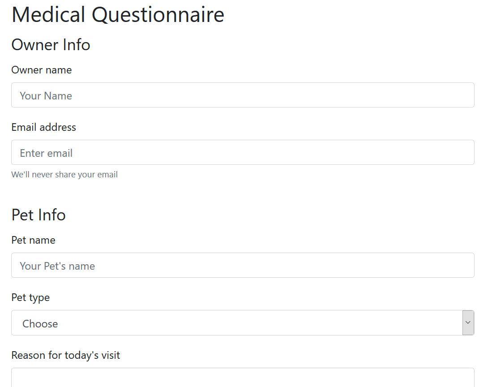
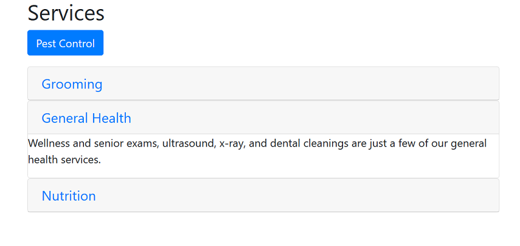

This is a lesson on Bootstrap 4's features (https://www.lynda.com/Bootstrap-tutorials/Bootstrap-4-Essential-Training/372545-2.html(https://www.lynda.com/Bootstrap-tutorials/Bootstrap-4-Essential-Training/372545-2.html)

<ul> Topic includes:
	<li>Working with grid containers</li>
	<li>Using form styles</li>
	<li>Nav and Navbar</li>
	<li>Layout components-cards</li>
	<li>Interactive Components: accordion,carousel etc</li>

</ul>

A Basic Form

Accorion: only one will be expanded

A card layout

Carousel: A Slide picture show

Scrollspy:Section name is active

Ren
10/16/2018
